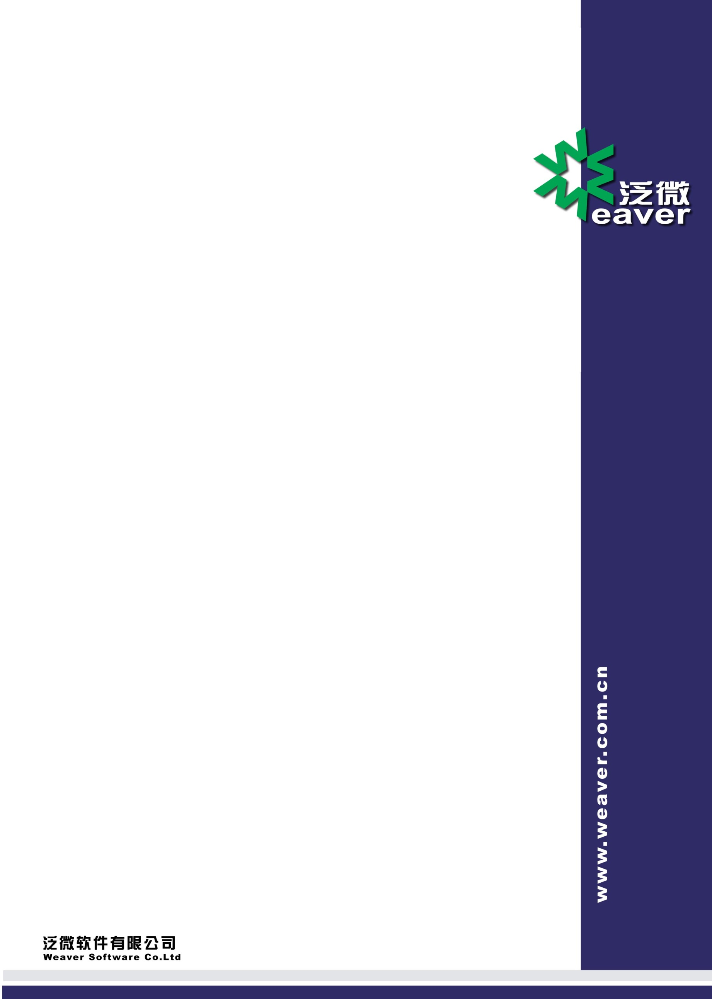

# 

Weaver Software

中国上海耀华支路泛微软件大厦

邮政编码：200122

电话：+86 21 50942228

传真：+86 21 50942278

泛微协同办公平台E-cology8.0版本后台维护手册(12)--建模引擎

**版权说明**

本手册以及相关的计算机软件程序仅用于为泛微协同管理平台最终用户提供信息，上海泛微网络科技股份有限公司有权。本手册是上海泛微网络科技股份有限公司的专有信息，并受中华人民共和国版权法和国际公约的保护。

未得到上海泛微网络科技股份有限公司明确的书面许可，不得为任何目的、以任何形式或手段辅助或传播本手册的任何部分内容。

本手册内容若有变动，恕不另行通知。本手册中例子中所引用的公司、人名和数据若非特殊说明，均属虚构。

本手册以及本手册所提及的任何产品的使用均受适应的最终用户许可协议限制。本手册由上海泛微网络科技股份有限公司制作。本手册中提及的所有商标、商标名称、服务标志及徽标均归其各自公司所有。