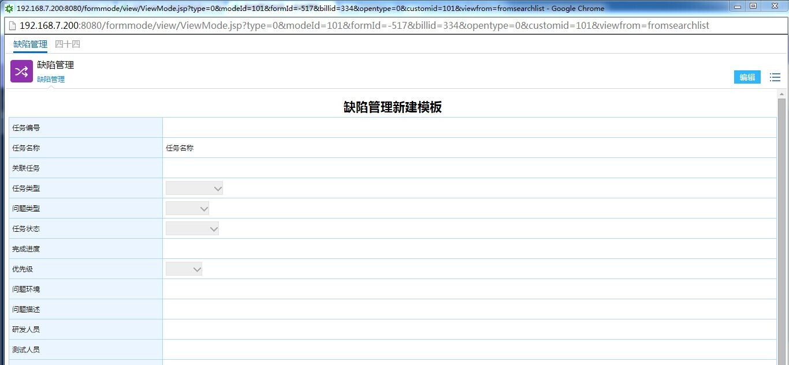

## 保存（新建，更新）

### ****10.2.1、方法介绍**** {#10-2-1}

方法：saveModeData(String paramXml)

输入参数：@param paramXml

输出参数：String: 返回保存状态，返回的值如下

|  &lt;?xml version=&quot;1.0&quot; encoding=&quot;UTF-8&quot;?&gt;&lt;ROOT&gt;&lt;return&gt;&lt;id&gt;334&lt;/id&gt;&lt;returnnode&gt;0&lt;/returnnode&gt;&lt;returnmessage&gt;操作成功！&lt;/returnmessage&gt;&lt;/return&gt;&lt;/ROOT&gt; |
| --- |

### ****10.2.2、实例效果**** {#10-2-2}

调用实例如下

| ModeDateService modeDateService = **new**ModeDateService(); |
| --- |

 执行完的效果如下：

