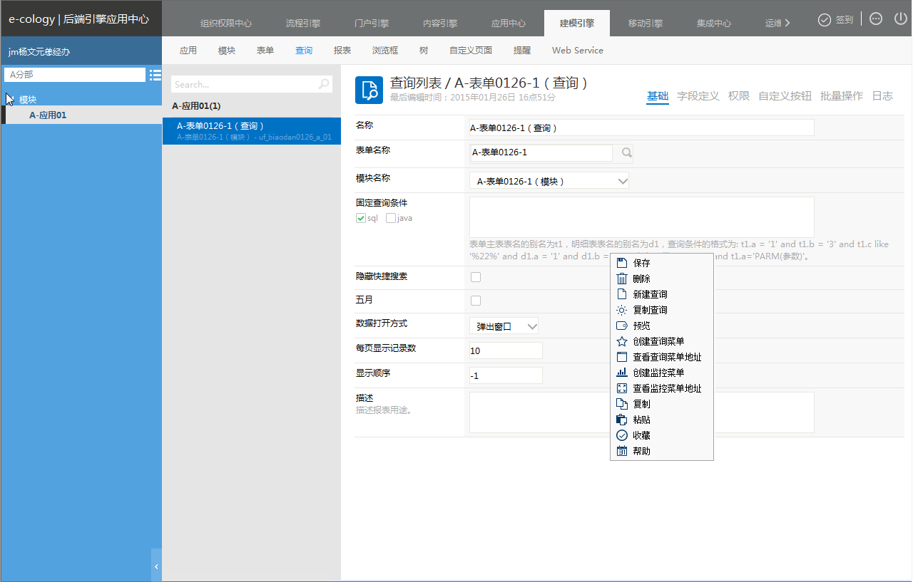

## 批量操作

### ****4.15.1、概述**** {#4-15-1}

批量操作页面是用于配置此查询列表上右键需要显示那些按钮

### ****4.15.2、功能说明**** {#4-15-2}

通过进入【后端应用中心】→【建模引擎】→点击一个具体的“查询”下的“批量操作”tab页如下图

此页面上的按钮分为两种操作类型。分别为系统默认和用户自定义。系统默认是每个查询页面都会共用的几个系统默认的按钮。用户自定义是通过页面扩展中所配置的自定义按钮具体如何配置如 **《页面扩展》**。

针对此页面的功能点说明如下：

*   显示名称：用户可以自己定义右键按钮的显示名称。
*   是否启用：勾选表示此按钮在查询列表右键菜单中显示。默认新创建的用户自定义的按钮是不启用的。如果需要启用需要用户手动来启用。
*   显示顺序：定义右键按钮的显示顺序。

注意：如果用户针对此查询列表在页面扩展中设置了右键按钮 用户需要在此页面上勾选了方可显示。