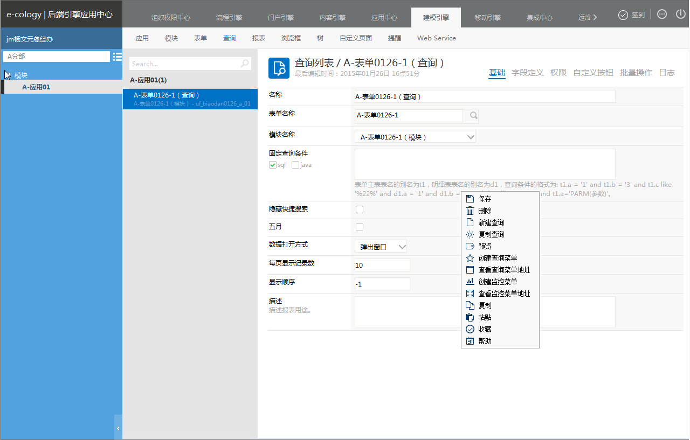

## 日志

### ****4.16.1、概述**** {#4-16-1}

日志是记录后端查询的操作日志

### ****4.16.2、功能说明**** {#4-16-2}

通过进入【后端应用中心】→【建模引擎】→点击一个具体的“查询”下的“日志”tab页如下图

说明：

*   此页面上记录查询基础数据的新建和编辑的操作日志。
*   在此页面上可以根据操作人，操作类型，操作时间进行数据搜索。

注意：此页面是记录查询后端的操作日志。

1.  报表